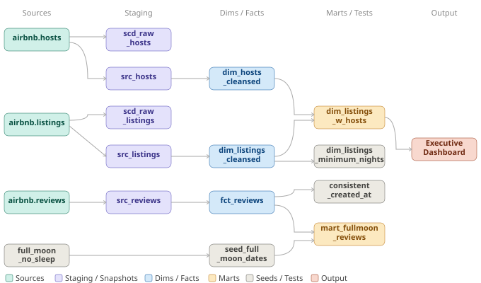

# Airbnb Analytics  dbt + Snowflake Project

A dbt project built on Snowflake that transforms raw Airbnb data into analytics-ready models. It covers core dbt concepts including dimensional modeling, incremental loading, snapshots, testing, and documentation.

---

## Table of Contents

- [Overview](#overview)
- [Project Structure](#project-structure)
- [Data Models](#data-models)
- [Prerequisites](#prerequisites)
- [Installation](#installation)
- [Configuration](#configuration)
- [Running the Project](#running-the-project)
- [Testing](#testing)
- [Documentation](#documentation)
- [Project Architecture](#project-architecture)
- [What I Learned](#what-i-learned)

---

## Overview

This project takes raw Airbnb data (hosts, listings, reviews) loaded into Snowflake and transforms it through a layered architecture into clean, tested, analytics-ready tables.

**Stack**: dbt Core + Snowflake

**Concepts covered**:
- Source definitions and freshness checks
- Ephemeral, table, view, and incremental materializations
- Dimensional modeling (star schema)
- Slowly Changing Dimensions via snapshots (SCD Type 2)
- Generic and singular data tests
- Custom macros and reusable generic tests
- Seed files
- dbt documentation and lineage graph

---

## Project Structure

```
airbnb/
├── models/
│   ├── src/                      # Source models (ephemeral)
│   │   ├── src_hosts.sql
│   │   ├── src_listings.sql
│   │   └── src_reviews.sql
│   ├── dim/                      # Dimension tables
│   │   ├── dim_hosts_cleansed.sql
│   │   ├── dim_listings_cleansed.sql
│   │   └── dim_listings_w_hosts.sql
│   ├── fct/                      # Fact tables
│   │   └── fct_reviews.sql
│   ├── mart/                     # Mart/reporting models
│   │   └── mart_fullmoon_reviews.sql
│   ├── schema.yml
│   └── sources.yml
├── tests/
│   ├── consistent_created_at.sql
│   ├── dim_listings_minimum_nights.sql
│   └── generic/
│       ├── minimum_row_count.sql
│       └── positive_values.sql
├── macros/
│   ├── select_positive_values.sql
│   └── no_empty_strings.sql
├── seeds/
│   └── seed_full_moon_dates.csv
├── snapshots/
│   ├── raw_hosts_snapshot.yml
│   └── raw_listings_snapshot.yml
├── dbt_project.yml
├── profiles.yml                  # Not committed — see Configuration
└── packages.yml
```

---

## Data Models

### Source Models (`src/`)
**Materialization**: Ephemeral

Thin wrappers over the raw Snowflake tables. These compile to CTEs and don't create any database objects — just a clean abstraction layer before cleansing.

- `src_hosts` — raw host records
- `src_listings` — raw listings with pricing
- `src_reviews` — raw review events with timestamps

### Dimension Models (`dim/`)
**Materialization**: Table

- `dim_hosts_cleansed` — deduplication, null name handling (defaulted to `Anonymous`)
- `dim_listings_cleansed` — price cast to numeric, minimum nights validated, room type categorized
- `dim_listings_w_hosts` — denormalized join of listings + host info for downstream use

### Fact Models (`fct/`)
**Materialization**: Incremental

- `fct_reviews` — review events with surrogate keys generated via `dbt_utils.generate_surrogate_key`. Loads only new rows based on `review_date`, with `on_schema_change='fail'` to catch unintended schema drift.

### Mart Models (`mart/`)
**Materialization**: Table

- `mart_fullmoon_reviews` — joins review data with seed full moon dates to enable analysis of review sentiment patterns around full moon periods.

---

## Prerequisites

- Python 3.10+
- A Snowflake account with a warehouse, database, and schema set up
- Git

---

## Installation

```bash
# Clone the repo
git clone <your-repo-url>
cd airbnb

# Create and activate virtual environment
python -m venv venv
source venv/bin/activate  # Windows: venv\Scripts\activate

# Install dependencies
pip install -r requirements.txt
```

Key packages:
- `dbt-core >= 1.11.0`
- `dbt-snowflake >= 1.11.0`
- `dbt-utils >= 1.3.0`

---

## Configuration

Create `~/.dbt/profiles.yml` with your Snowflake credentials:

```yaml
airbnb:
  target: dev
  outputs:
    dev:
      type: snowflake
      account: [your-account-id]
      user: [your-username]
      password: [your-password]
      role: [your-role]
      database: [your-database]
      schema: [your-dev-schema]
      warehouse: [your-warehouse]
      threads: 4
      client_session_keep_alive: False
```

> **Note**: `profiles.yml` is gitignored. Never commit credentials.

---

## Running the Project

```bash
# Validate connection and config
dbt debug

# Run all models
dbt run

# Run a specific model
dbt run --select dim_listings_cleansed

# Full refresh (rebuilds all incremental models from scratch)
dbt run --full-refresh

# Run models + all upstream/downstream dependencies
dbt run --select +fct_reviews+

# Run snapshots
dbt snapshot

# Check source freshness
dbt source freshness

# Generate and serve docs
dbt docs generate
dbt docs serve
```

---

## Testing

```bash
# Run all tests
dbt test

# Run tests for a specific model
dbt test --select dim_hosts_cleansed

# Stop on first failure
dbt test --fail-fast
```

Test failures are stored in a `test_failures` schema for debugging.

### Test types used in this project

| Type | Examples |
|------|----------|
| Generic (built-in) | `unique`, `not_null`, `relationships`, `accepted_values` |
| Custom singular | `consistent_created_at`, `dim_listings_minimum_nights` |
| Custom generic | `positive_values`, `minimum_row_count` |

---

## Documentation

```bash
dbt docs generate
dbt docs serve
# Visit http://localhost:8000
```

The docs site includes model descriptions, column definitions, the full lineage DAG, and test coverage.

---

## Project Architecture

### Data Flow



### Materialization Strategy

| Layer | Materialization | Reason |
|-------|-----------------|--------|
| `src_*` | Ephemeral | No need for DB objects; just abstraction |
| `dim_*` | Table | Stable dimensions, fully rebuilt each run |
| `fct_*` | Incremental | Append-only events; cost-efficient for large volumes |
| `mart_*` | Table | Business-ready; fast for reporting queries |

### Incremental Logic (`fct_reviews`)

```sql
WHERE review_date > (SELECT MAX(review_date) FROM {{ this }})
```

Only new reviews are processed on each run. Use `dbt run --full-refresh` to rebuild from scratch.

---

## What I Learned

A few things worth noting about the design decisions made in this project:

- **Materialization trade-offs matter more than I expected.** Choosing between ephemeral, table, view, and incremental isn't just a performance decision — it shapes how you think about your DAG and what objects actually exist in your warehouse.

- **Snapshots are elegant but specific.** SCD Type 2 tracking via `dbt snapshot` is clean to implement, but understanding *when* to use it (slowly changing attributes you need history on, not event data) took a bit to internalize.

- **The testing layer is what makes dbt production-grade.** Generic tests are easy to add but custom singular and generic tests are where you encode actual business logic. Writing `consistent_created_at` and `dim_listings_minimum_nights` made the data quality story feel real.

- **Surrogate keys via `dbt_utils`.** Generating stable surrogate keys using `generate_surrogate_key` in the fact table — and understanding *why* you'd do that instead of relying on natural keys — was a useful pattern to practice.

- **Incremental models require more thought.** `on_schema_change='fail'` is a simple flag but it forces you to be intentional about schema evolution, which is the right mindset for production pipelines.

---

**Stack**: dbt Core 1.11+ · Snowflake · dbt-utils
